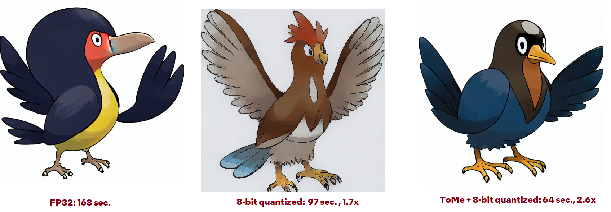

# Token Merging for Stable Diffusion running with OpenVINO

This is an OpenVINO adoped version of Token Merging method for Stable Diffusion. The method is applied to PyTorch model before exporting to OpenVINO representation. It can be also stacked with 8-bit quantization to achieve a higher inference speed. See details and example in the [Optimum-Intel](https://github.com/huggingface/optimum-intel/tree/main/examples/openvino/stable-diffusion).

Here are the results for 100 iteration of 512x512 image generation on CPU.


This is the official implementation of **ToMe for SD** from the paper:  
**[Token Merging for Fast Stable Diffusion](https://arxiv.org/abs/2303.17604)**

ToMe for SD is an extension of the original **ToMe**:  
**[Token Merging: Your ViT but Faster](https://arxiv.org/abs/2210.09461)**  


## Supported Environments

This repo includes code to patch an existing Stable Diffusion environment. Currently, we support the following implementations:
 - [x] [Diffusers](https://github.com/huggingface/diffusers)
 - [ ] And potentially others

**Note:** This also supports most downstream UIs that use these repositories.


## Installation

ToMe for SD requires ``pytorch >= 1.12.1`` (for `scatter_reduce`), which you can get from [here](https://pytorch.org/get-started/locally/). Then after installing your choice of stable diffusion environment ([supported environments](#supported-environments)), use the corresponding python environment to install ToMe for SD:

```bash
pip install git+https://github.com/AlexKoff88/tomesd.git
```

## Usage
ToMe can also be used to patch a 🤗 Diffusers Stable Diffusion pipeline:
```py
import torch, tomeov
from diffusers import StableDiffusionPipeline

pipe = StableDiffusionPipeline.from_pretrained("runwayml/stable-diffusion-v1-5")

save_dir = "stable_diffusion_optimized"
# Apply ToMe with a 50% merging ratio
tomeov.apply_patch(pipe, ratio=0.5) # Can also use pipe.unet in place of pipe here
tomeov.export_diffusion_pipeline(save_dir)

ov_pipe = OVStableDiffusionPipeline.from_pretrained(save_dir, compile=False)
ov_pipe.reshape(batch_size=1, height=512, width=512, num_images_per_prompt=1)
ov_pipe.compile()

image = pipe("a photo of an astronaut riding a horse on mars").images[0]
image.save("astronaut.png")
```
You can remove the patch with `tomesd.remove_patch(pipe)`.
